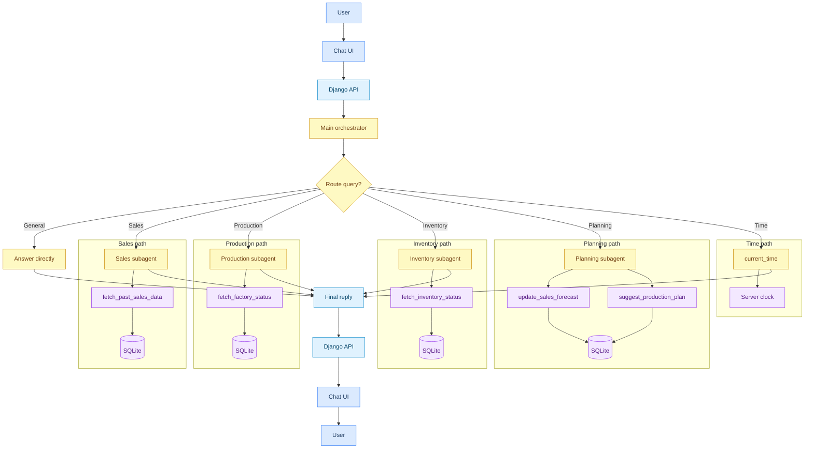

# strands-test

A Django app with a chat UI and JSON HTTP API, backed by a [Strands Agents](https://strandsagents.com/) agent on Amazon Bedrock using `google.gemma-3-4b-it`.

The browser UI at `/` sends messages to the API, which stores conversation history in SQLite and returns assistant replies. No login or other pages are included.

The main agent routes specialized questions to four subagents, and can call direct tools for other requests:

- **Sales forecast agent** — uses `fetch_past_sales_data` to read historical sales from SQLite
- **Production schedule agent** — uses `fetch_factory_status` to read factory lines and production orders
- **Inventory agent** — uses `fetch_inventory_status` to read stock levels and projected availability
- **Planning agent** — uses `update_sales_forecast` and `suggest_production_plan` to revise demand assumptions and recommend production changes
- **Current time tool** — uses `current_time` to return the local date and time

## Query flow



1. The user sends a message from the chat UI to the Django API.
2. The main orchestrator inspects the query and picks one path: sales, production, inventory, planning, time, or a direct answer.
3. Specialist subagents call their tool and read from SQLite, or the orchestrator calls `current_time` directly for time questions.
4. The orchestrator composes the final reply and sends it back through the API to the chat UI.

## Setup

```bash
uv sync
uv run python manage.py migrate
uv run python manage.py seed_dummy_data
```

Set AWS credentials for Bedrock (for example `AWS_REGION`, `AWS_ACCESS_KEY_ID`, `AWS_SECRET_ACCESS_KEY`).

## Run

```bash
uv run python manage.py runserver
```

Open http://127.0.0.1:8000/

## API

- `POST /api/conversations/` — create a conversation
- `GET /api/conversations/<uuid>/messages/` — list messages
- `POST /api/conversations/<uuid>/messages/send/` — send a message and get a reply
