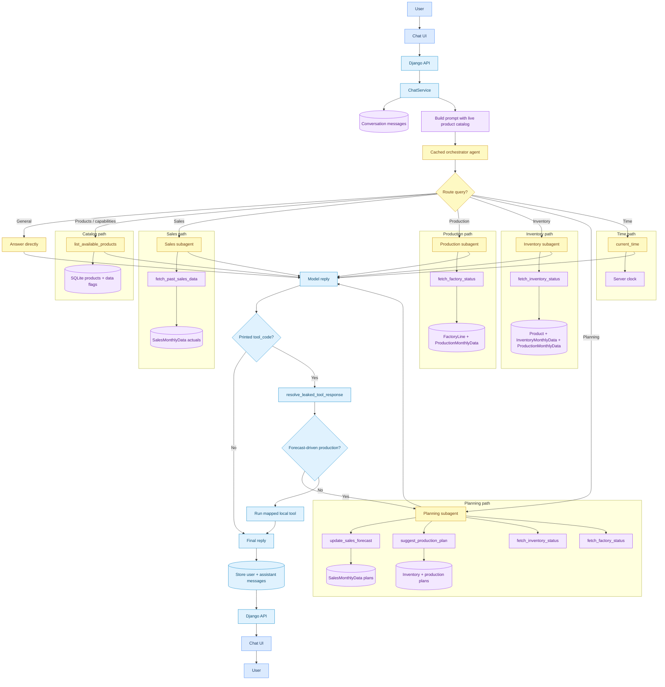

# strands-test

A Django app with a chat UI and JSON HTTP API, backed by a [Strands Agents](https://strandsagents.com/) agent on Amazon Bedrock using `google.gemma-3-4b-it`.

The browser UI at `/` sends messages to the API, which stores conversation history in SQLite and returns assistant replies. No login or other pages are included.

`ChatService` keeps one cached Strands orchestrator agent per conversation. Before each turn, the orchestrator prompt is rebuilt with the live product catalog from SQLite, then the model routes the message to direct tools or specialist subagents:

- **Product catalog tool** — uses `list_available_products` to list products and available data types
- **Sales forecast agent** — uses `fetch_past_sales_data` to read historical sales actuals from SQLite
- **Production schedule agent** — uses `fetch_factory_status` to read factory lines and monthly production actual/plan data
- **Inventory agent** — uses `fetch_inventory_status` to read stock levels, reservations, reorder points, and incoming production
- **Planning agent** — uses `update_sales_forecast` and `suggest_production_plan` to revise demand assumptions and recommend advisory production changes
- **Current time tool** — uses `current_time` to return the local date and time

The model is instructed to call tools through the Strands tool interface. If it still prints a `tool_code` block, `resolve_leaked_tool_response` parses and runs the matching local tool, and redirects forecast-driven production requests from `production_schedule_assistant` to `planning_assistant`.

## Query flow



1. The user sends a message from the chat UI to the Django API.
2. `ChatService` loads or creates the conversation's cached orchestrator, rebuilds its system prompt with the current product catalog, and sends the user message to Strands.
3. The orchestrator follows the prompt routing rules: product catalog, sales, production schedule, inventory, planning, time, or direct general conversation.
4. Specialist subagents call their database-backed tools. Planning requests update `SalesMonthlyData.plan_units` when the user changes forecasts, then compare forecast demand with inventory and incoming production. Recommendations are advisory; they do not create production plan rows.
5. Every request, agent invocation, model call, and tool call is logged through `FLOW_LOG_HOOKS` with the conversation ID.
6. If the model prints a tool call instead of invoking it, `resolve_leaked_tool_response` runs the equivalent local tool. Forecast-driven production leaks are redirected to `planning_assistant`.
7. The final assistant text is stored with the user message and returned through the API to the chat UI.

## Setup

```bash
uv sync
uv run python manage.py migrate
uv run python manage.py seed_dummy_data
```

Set AWS credentials for Bedrock (for example `AWS_REGION`, `AWS_ACCESS_KEY_ID`, `AWS_SECRET_ACCESS_KEY`).

## Model

The Bedrock model ID is set in `config/settings.py` as `CHAT_MODEL_ID`. The default is `google.gemma-3-4b-it`. This value is used by the main orchestrator and every subagent.

```python
CHAT_MODEL_ID = "google.gemma-3-4b-it"
```

Change it to any model ID available in your AWS account and region (for example `anthropic.claude-3-5-sonnet-20241022-v2:0`). Restart the Django server after changing the setting.

## Run

```bash
uv run python manage.py runserver
```

Open http://127.0.0.1:8000/

## API

- `POST /api/conversations/` — create a conversation
- `GET /api/conversations/<uuid>/messages/` — list messages
- `POST /api/conversations/<uuid>/messages/send/` — send a message and get a reply
